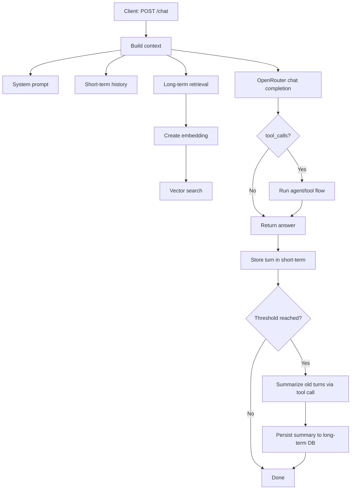

# Personal Assistant


> Local-first Go agent: safe to run on personal devices and designed to optimize every token in large-context workflows.

[Русская версия](README.ru.md)

---

## Why This Project

Frontier models now provide context windows of up to millions of tokens, but that does not make agents cheap or safe by default.
If an agent regularly consumes even ~20-30% of a huge context window, call cost grows fast.
And many existing agent setups require running on a VPS, which increases exposure for personal data and infrastructure.

Project philosophy:

- run safely on personal machines and other devices without mandatory remote hosting
- treat every token as expensive (tight context budgeting and summarization)
- keep security practical via local execution and transparent memory architecture

To achieve this, each request is assembled from layered context:

- system prompt budget
- recent dialog turns (short-term memory)
- retrieved long-term summaries (vector search)

Result: more stable responses, predictable cost, and local-first security.

---

## At a Glance

| Area | What it does |
|---|---|
| API | `POST /chat`, `POST /memory`, `POST /msg` |
| LLM | OpenRouter chat + embeddings |
| Memory | In-process short-term + persisted long-term summaries |
| Storage modes | Local (`PostgreSQL + pgvector`) or Pinecone |
| Runtime | Request queue, graceful shutdown, HTTP timeouts, local DB auto-migrations |

---

## Module Readiness Matrix

| Module | Status | Notes |
|---|---|---|
| `internal/api` | Stable | Core endpoints and handlers are in place |
| `internal/llmCalls` | Stable | Queue + request layer with tests |
| `internal/ai/memory` | Stable | Context assembly + safer summarization commit |
| `internal/database/localCombinedDB` | Stable | PostgreSQL + pgvector combined storage |
| `internal/database/pinecone` | Beta | Works when configured; less test depth than local mode |
| Tool calls in `/chat` flow | Stable | Handles `agent_mode` and executes tool flow inside chat pipeline |

Legend: `Stable` = ready for regular use, `Beta` = usable with caveats.

---

## Request Flow



---

## Project Layout

```text
cmd/main.go                          # entrypoint, startup, shutdown
internal/api                         # HTTP handlers and routes
internal/ai                          # memory orchestration + model interaction
internal/llmCalls                    # OpenRouter calls + queue
internal/database                    # DB abstraction (local / pinecone)
internal/database/localCombinedDB    # PostgreSQL + pgvector implementation
internal/config                      # settings + env overrides
internal/models                      # DTOs
internal/logg                        # structured logger
```

---

## Configuration

### 1) OpenRouter

- `api_key_openrouter`
- `model_chat_openrouter`
- `model_embending_openrouter`
- `api_url_openrouter`
- `api_url_openrouter_embeddings`

### 2) Storage mode

Use one mode at a time.

**Pinecone mode** (enabled when `pinecore_api_key` is set):

- `pinecore_api_key`
- `pinecore_indexName`
- `pinecore_cloud`
- `pinecore_region`
- `pinecore_embedModel`

**Local mode** (used when Pinecone key is empty):

- `local_postgres_dsn`
- `local_postgres_table`
- `local_vector_dimension`

### 3) Service

- `api_host`
- `api_port`

### 4) Memory & prompts

- `promt_system_chat`
- `promt_system_agent` *(optional)* – instructions used when the AI enters agent/reasoning mode; falls back to a built‑in guideline if unset.
- `promt_memory_summary`
- `memory_summary_user_promt`
- `context_limit`
- `context_saved_for_response`
- `summary_memory_step`
- `short_memory_messages_count`
- `memory_state_file` (default: `./data/memory_state.json`)
- `context_coeff`
- `context_coeff_count`
- `system_memory_percent`
- `user_profile_percent`
- `tools_memory_percent`
- `long_term_percent`
- `short_term_percent`
- `system_prompt_percent`

### 5) LLM retry tuning

- `llm_retry_max_attempts` (default fallback: `3`)
- `llm_retry_base_delay_ms` (default fallback: `200`)
- `llm_retry_max_delay_ms` (default fallback: `2000`)

All fields above can be overridden with env vars (`UPPER_SNAKE_CASE`), for example:
`API_KEY_OPENROUTER`, `LOCAL_POSTGRES_DSN`, `MEMORY_STATE_FILE`, `LLM_RETRY_MAX_ATTEMPTS`.

---

## Quick Start

### 1) Prepare settings file

```bash
cp settigns_example.json settings.json
```

### 2) Local PostgreSQL bootstrap (local mode)

```bash
psql "$LOCAL_POSTGRES_DSN" -c "CREATE EXTENSION IF NOT EXISTS vector;"
```

Set `local_postgres_dsn` in `settings.json` (or `LOCAL_POSTGRES_DSN`).
When the service starts, embedded migrations create/update the summaries table and indexes automatically.

### 3) Run service

```bash
go run ./cmd
```

Optional log mode:

```bash
go run ./cmd --log pretty
```

Server listens at: `http://<api_host>:<api_port>`

---

## Logging

The service always writes logs to a timestamped file in the working directory:
`YYYY-MM-DD_HH-MM-SS.log`.

Console output mode is controlled by `--log`:

- `--log full` (default): color console output with all log records.
- `--log pretty`: compact operator-friendly output focused on key events.
- `--log none`: disable console output (file logging is still enabled).

Main module tags are included via `[MODULE]` (for example: `SYSTEM`, `API`, `AI`, `DB`, `AGENT`).
Custom levels include `QUESTION`, `ANSWER`, `TASK`, `AGENT`, `MEMORY`.

---

## API Surface

| Endpoint | Method | Purpose |
|---|---|---|
| `/chat` | `POST` | Main chat request |
| `/memory` | `POST` | Dump current in-memory state |
| `/msg` | `POST` | Dump generated context messages |

### `POST /chat` example

```json
{
  "message": "hello"
}
```

Status codes:

- `200` success
- `400` invalid request
- `413` payload too large (limit: 1 MiB)
- `500` internal error

---

## Improvement Ideas

### Stability Improvements

- Add API authentication/authorization and per-token rate limiting.
- Add `GET /healthz` and `GET /readyz` with database and model checks.
- Add integration tests for full `/chat` + memory + tool flow.
- Add metrics endpoint (Prometheus) for queue depth, latency, and error rates.

### Functional Improvements

- Add configurable retention and archive strategy for long-term summaries.
- Add role-based access control for debug endpoints (`/memory`, `/msg`).
- Add support for multiple memory profiles per user/session.

### Features

- Add SSE/streaming responses for long model outputs.
