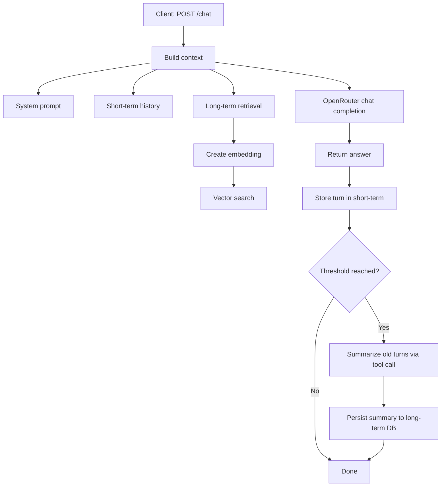

# Personal Assistant


> Local Go service for OpenRouter chat with layered memory (system-prompt + user-profile + tools-history + short-term + long-term ) and pluggable vector storage.

[Русская версия](README.ru.md)

---

## Why This Project

Instead of a plain chat proxy, this service builds a memory-aware context on each request:

- system prompt budget
- recent dialog turns (short-term memory)
- retrieved long-term summaries (vector search)

Result: more stable, context-aware answers with predictable token budgeting.

---

## At a Glance

| Area | What it does |
|---|---|
| API | `POST /chat`, `POST /memory`, `POST /msg` |
| LLM | OpenRouter chat + embeddings |
| Memory | In-process short-term + persisted long-term summaries |
| Storage modes | Local (`PostgreSQL + pgvector`) or Pinecone |
| Runtime | Request queue, graceful shutdown, HTTP timeouts |

---

## Module Readiness Matrix

| Module | Status | Notes |
|---|---|---|
| `internal/api` | Stable | Core endpoints and handlers are in place |
| `internal/llmCalls` | Stable | Queue + request layer with tests |
| `internal/ai/memory` | Stable | Context assembly + safer summarization commit |
| `internal/database/localCombinedDB` | Stable | PostgreSQL + pgvector combined storage |
| `internal/database/pinecone` | Beta | Works when configured; less test depth than local mode |
| Tool calls in `/chat` flow | Limited | Returns `501` when model emits `tool_calls` |

Legend: `Stable` = ready for regular use, `Beta` = usable with caveats, `Limited` = intentionally incomplete.

---

## Request Flow



---

## Project Layout

```text
cmd/main.go                          # entrypoint, startup, shutdown
internal/api                         # HTTP handlers and routes
internal/ai                          # memory orchestration + model interaction
internal/llmCalls                    # OpenRouter calls + queue
internal/database                    # DB abstraction (local / pinecone)
internal/database/localCombinedDB    # PostgreSQL + pgvector implementation
internal/config                      # settings + env overrides
internal/models                      # DTOs
internal/logg                        # structured logger
```

---

## Configuration

### 1) OpenRouter

- `api_key_openrouter`
- `model_chat_openrouter`
- `model_embending_openrouter`
- `api_url_openrouter`
- `api_url_openrouter_embeddings`

### 2) Storage mode

Use one mode at a time.

**Pinecone mode** (enabled when `pinecore_api_key` is set):

- `pinecore_api_key`
- `pinecore_indexName`
- `pinecore_cloud`
- `pinecore_region`
- `pinecore_embedModel`

**Local mode** (used when Pinecone key is empty):

- `local_postgres_dsn`
- `local_postgres_table`
- `local_vector_dimension`

### 3) Service

- `api_host`
- `api_port`

### 4) Memory & prompts

- `promt_system_chat`
- `promt_system_agent` *(optional)* – instructions used when the AI enters agent/reasoning mode; falls back to a built‑in guideline if unset.
- `promt_memory_summary`
- `memory_summary_user_promt`
- `context_limit`
- `context_saved_for_response`
- `summary_memory_step`
- `short_memory_messages_count`
- `memory_state_file` (default: `./data/memory_state.json`)
- `context_coeff`
- `context_coeff_count`
- `system_memory_percent`
- `user_profile_percent`
- `tools_memory_percent`
- `long_term_percent`
- `short_term_percent`
- `system_prompt_percent`

---

## Quick Start

### Local PostgreSQL bootstrap

```bash
psql -U postgres -d postgres -f scripts/postgres_bootstrap.sql
psql "$LOCAL_POSTGRES_DSN" -c "CREATE EXTENSION IF NOT EXISTS vector;"
```

Set `local_postgres_dsn` in `settings.json` or `LOCAL_POSTGRES_DSN`.

### Run service

```bash
go run ./cmd
```

Server listens at: `http://<api_host>:<api_port>`

---

## API Surface

| Endpoint | Method | Purpose |
|---|---|---|
| `/chat` | `POST` | Main chat request |
| `/memory` | `POST` | Dump current in-memory state |
| `/msg` | `POST` | Dump generated context messages |

### `POST /chat` example

```json
{
  "message": "hello"
}
```

Status codes:

- `200` success
- `400` invalid request
- `500` internal error
- `501` model returned `tool_calls` not implemented in chat flow

---

## Production Checklist

- [ ] Add authentication/authorization in front of API
- [ ] Restrict or disable `/memory` and `/msg` in prod
- [ ] Store secrets via environment/secret manager (not in `settings.json`)
- [ ] Add request rate limiting and body size limits
- [ ] Add health endpoint and readiness checks
- [ ] Configure centralized logs and alerting
- [ ] Add integration tests for full `/chat` flow
- [ ] Define backup/retention policy for long-term storage

---

## Security Notes

- `settings.json` is plaintext.
- Do not commit real API keys/tokens.
- Protect `/memory` and `/msg` in production.
 
