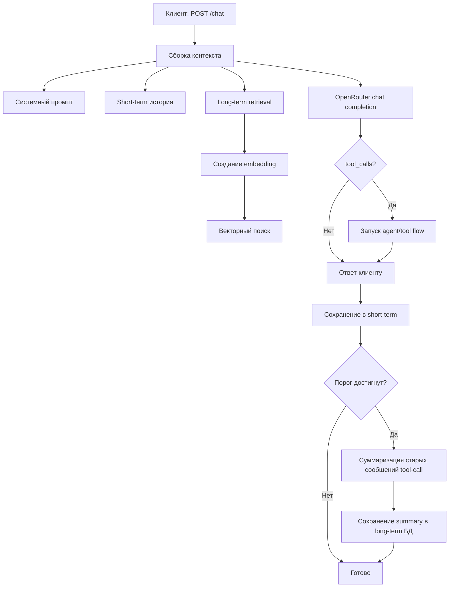

# Personal Assistant


> Local-first агент на Go: безопасный для запуска на личных устройствах и экономный к токенам при работе с большими контекстами.

[English version](README.md)

---

## Зачем этот проект

Передовые модели уже поддерживают окна контекста до миллионов токенов, но это не делает агент дешевым и безопасным «по умолчанию».
Если агент постоянно использует даже ~20-30% большого окна, стоимость вызовов быстро растет.
Плюс многие агентные решения требуют VPS, что добавляет риски для личных данных и инфраструктуры.

Философия проекта:

- запуск на личном ПК и других устройствах без обязательного внешнего сервера
- внимательное отношение к каждому токену (сжатие и контроль контекста)
- практическая безопасность: локальное выполнение и прозрачная архитектура памяти

Для этого на каждый запрос сервис собирает контекст из нескольких слоев:

- бюджет системного промпта
- недавние сообщения (short-term memory)
- релевантные long-term summary из векторного поиска

Итог: более устойчивые ответы, предсказуемая стоимость и локально-ориентированная безопасность.

---

## Кратко

| Область | Что делает |
|---|---|
| API | `POST /chat`, `POST /memory`, `POST /msg` |
| LLM | OpenRouter chat + embeddings |
| Память | short-term в процессе + long-term summary в БД |
| Режимы хранения | Local (`PostgreSQL + pgvector`) или Pinecone |
| Runtime | Очередь запросов, graceful shutdown, HTTP таймауты, auto-migrations для local DB |

---

## Матрица готовности модулей

| Модуль | Статус | Комментарий |
|---|---|---|
| `internal/api` | Stable | Основные endpoint’ы и хендлеры готовы |
| `internal/llmCalls` | Stable | Очередь и слой запросов покрыты тестами |
| `internal/ai/memory` | Stable | Сборка контекста + безопасный commit суммаризации |
| `internal/database/localCombinedDB` | Stable | Комбинация PostgreSQL + pgvector |
| `internal/database/pinecone` | Beta | Работает при конфиге, но покрытие ниже local mode |
| Tool calls в `/chat` flow | Stable | Обрабатывает `agent_mode` и выполняет tool flow внутри chat pipeline |

Легенда: `Stable` = подходит для регулярного использования, `Beta` = можно использовать с оговорками.

---

## Поток запроса



---

## Структура проекта

```text
cmd/main.go                          # entrypoint, запуск, shutdown
internal/api                         # HTTP-роуты и хендлеры
internal/ai                          # orchestration памяти и модели
internal/llmCalls                    # вызовы OpenRouter + очередь
internal/database                    # абстракция БД (local / pinecone)
internal/database/localCombinedDB    # реализация PostgreSQL + pgvector
internal/config                      # settings + env overrides
internal/models                      # DTO
internal/logg                        # структурный логгер
```

---

## Конфигурация

### 1) OpenRouter

- `api_key_openrouter`
- `model_chat_openrouter`
- `model_embending_openrouter`
- `api_url_openrouter`
- `api_url_openrouter_embeddings`

### 2) Режим хранения

Используется один режим за раз.

**Pinecone режим** (если задан `pinecore_api_key`):

- `pinecore_api_key`
- `pinecore_indexName`
- `pinecore_cloud`
- `pinecore_region`
- `pinecore_embedModel`

**Local режим** (если ключ Pinecone пуст):

- `local_postgres_dsn`
- `local_postgres_table`
- `local_vector_dimension`

### 3) Сервис

- `api_host`
- `api_port`

### 4) Память и промпты

- `promt_system_chat`
- `promt_system_agent` *(опционально)* – инструкции для agent/reasoning режима; при пустом значении используется встроенный prompt.
- `promt_memory_summary`
- `memory_summary_user_promt`
- `context_limit`
- `context_saved_for_response`
- `summary_memory_step`
- `short_memory_messages_count`
- `memory_state_file` (по умолчанию: `./data/memory_state.json`)
- `context_coeff`
- `context_coeff_count`
- `system_memory_percent`
- `user_profile_percent`
- `tools_memory_percent`
- `long_term_percent`
- `short_term_percent`
- `system_prompt_percent`

### 5) Параметры retry для LLM

- `llm_retry_max_attempts` (fallback по умолчанию: `3`)
- `llm_retry_base_delay_ms` (fallback по умолчанию: `200`)
- `llm_retry_max_delay_ms` (fallback по умолчанию: `2000`)

Все поля можно переопределить env-переменными (`UPPER_SNAKE_CASE`), например:
`API_KEY_OPENROUTER`, `LOCAL_POSTGRES_DSN`, `MEMORY_STATE_FILE`, `LLM_RETRY_MAX_ATTEMPTS`.

---

## Быстрый старт

### 1) Подготовить файл настроек

```bash
cp settigns_example.json settings.json
```

### 2) Подготовка PostgreSQL (local mode)

```bash
psql "$LOCAL_POSTGRES_DSN" -c "CREATE EXTENSION IF NOT EXISTS vector;"
```

Укажи `local_postgres_dsn` в `settings.json` (или `LOCAL_POSTGRES_DSN`).
При старте сервиса встроенные миграции автоматически создают/обновляют таблицу summaries и индексы.

### 3) Запуск

```bash
go run ./cmd
```

Опциональный режим вывода логов:

```bash
go run ./cmd --log pretty
```

Сервис слушает: `http://<api_host>:<api_port>`

---

## Логирование

Сервис всегда пишет логи в файл с таймстампом в рабочей директории:
`YYYY-MM-DD_HH-MM-SS.log`.

Режим консольного вывода задается флагом `--log`:

- `--log full` (по умолчанию): цветной консольный вывод со всеми записями.
- `--log pretty`: компактный операторский формат с акцентом на ключевые события.
- `--log none`: отключает консольный вывод (запись в файл остается).

Логи содержат тег модуля `[MODULE]` (например: `SYSTEM`, `API`, `AI`, `DB`, `AGENT`).
Используются кастомные уровни: `QUESTION`, `ANSWER`, `TASK`, `AGENT`, `MEMORY`.

---

## API

| Endpoint | Метод | Назначение |
|---|---|---|
| `/chat` | `POST` | Основной чат-запрос |
| `/memory` | `POST` | Снимок текущего in-memory состояния |
| `/msg` | `POST` | Список сообщений контекста для диагностики |

### Пример `POST /chat`

```json
{
  "message": "привет"
}
```

Коды ответа:

- `200` успех
- `400` невалидный запрос
- `413` payload слишком большой (лимит: 1 MiB)
- `500` внутренняя ошибка

---

## Идеи для улучшения

### Улучшения для стабильности

- Добавить аутентификацию/авторизацию API и rate limiting по токенам.
- Добавить `GET /healthz` и `GET /readyz` с проверкой базы и модели.
- Добавить integration-тесты полного `/chat` + memory + tool flow.
- Добавить endpoint метрик (Prometheus): глубина очереди, latency, error rate.

### Улучшения функционала

- Добавить настраиваемую стратегию хранения и архивирования long-term summary.
- Добавить ролевой доступ к debug endpoint’ам (`/memory`, `/msg`).
- Добавить поддержку нескольких memory-профилей на пользователя/сессию.
- Доработать основного агента 

### Фичи

- Добавить SSE/streaming ответы для длинных ответов модели.
- Добавить систему динамичсекую систему подбора промпта под запрос
- Добавить конструктор агентов

## Интерфейс 
- Добавить tui
- Добавить gui
- Добавить cli
- Доработать api