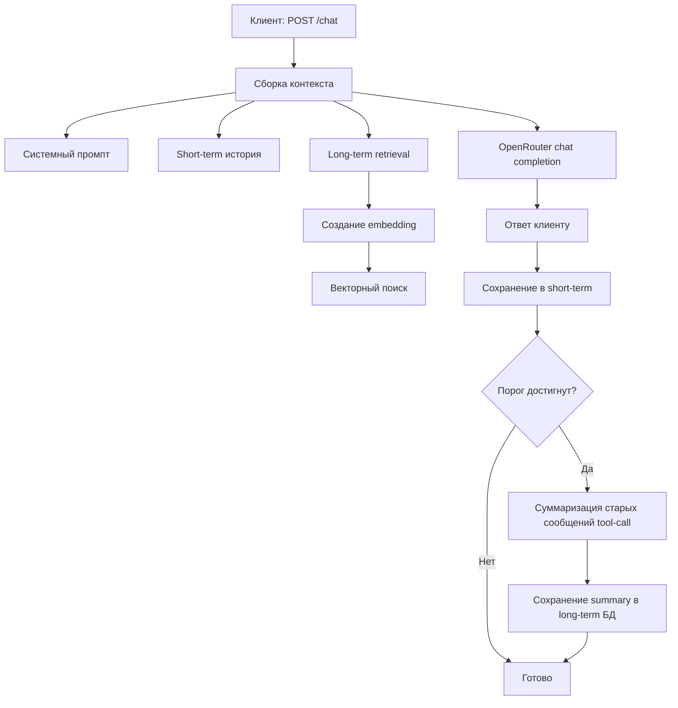

# Personal Assistant


> Локальный Go-сервис для чата через OpenRouter с многоуровневой памятью (system-prompt + user-profile + tools-history + short-term + long-term ) и переключаемым векторным хранилищем.

[English version](README.md)

---

## Зачем этот проект

Это не просто прокси к LLM. На каждый запрос сервис собирает контекст из нескольких слоев:

- бюджет системного промпта
- недавние сообщения (short-term memory)
- релевантные long-term summary из векторного поиска

Итог: более устойчивые ответы и предсказуемый контроль токенов.

---

## Кратко

| Область | Что делает |
|---|---|
| API | `POST /chat`, `POST /memory`, `POST /msg` |
| LLM | OpenRouter chat + embeddings |
| Память | short-term в процессе + long-term summary в БД |
| Режимы хранения | Local (`HNSW + MySQL`) или Pinecone |
| Runtime | Очередь запросов, graceful shutdown, HTTP timeouts |

---

## Матрица готовности модулей

| Модуль | Статус | Комментарий |
|---|---|---|
| `internal/api` | Stable | Основные endpoint’ы и хендлеры готовы |
| `internal/llmCalls` | Stable | Очередь и слой запросов покрыты тестами |
| `internal/ai/memory` | Stable | Сборка контекста + безопасный commit суммаризации |
| `internal/database/localCombinedDB` | Stable | Комбинация HNSW + MySQL |
| `internal/database/pinecone` | Beta | Работает при конфиге, но покрытие ниже local mode |
| Tool calls в `/chat` flow | Limited | При `tool_calls` возвращается `501` |

Легенда: `Stable` = подходит для регулярного использования, `Beta` = можно использовать с оговорками, `Limited` = намеренно неполная реализация.

---

## Поток запроса



---

## Структура проекта

```text
cmd/main.go                          # entrypoint, запуск, shutdown
internal/api                         # HTTP-роуты и хендлеры
internal/ai                          # orchestration памяти и модели
internal/llmCalls                    # вызовы OpenRouter + очередь
internal/database                    # абстракция БД (local / pinecone)
internal/database/localCombinedDB    # реализация HNSW + MySQL
internal/config                      # settings + env overrides
internal/models                      # DTO
internal/logg                        # структурный логгер
```

---

## Конфигурация

### 1) OpenRouter

- `api_key_openrouter`
- `model_chat_openrouter`
- `model_embending_openrouter`
- `api_url_openrouter`
- `api_url_openrouter_embeddings`

### 2) Режим хранения

Используется один режим за раз.

**Pinecone режим** (если задан `pinecore_api_key`):

- `pinecore_api_key`
- `pinecore_indexName`
- `pinecore_cloud`
- `pinecore_region`
- `pinecore_embedModel`

**Local режим** (если ключ Pinecone пуст):

- `local_mysql_dsn`
- `local_mysql_table`
- `local_db_path`
- `local_vector_dimension`

### 3) Сервис

- `api_host`
- `api_port`

### 4) Память и промпты

- `promt_system_chat`
- `promt_memory_summary`
- `memory_summary_user_promt`
- `context_limit`
- `context_saved_for_response`
- `summary_memory_step`
- `short_memory_messages_count`
- `context_coeff`
- `context_coeff_count`
- `system_memory_percent`
- `user_profile_percent`
- `tools_memory_percent`
- `long_term_percent`
- `short_term_percent`
- `system_prompt_percent`

---

## Быстрый старт

### Подготовка MySQL (local mode)

```bash
mysql -u root -p < scripts/mysql_bootstrap.sql
```

Укажи `local_mysql_dsn` в `settings.json` или `LOCAL_MYSQL_DSN`.

### Запуск

```bash
go run ./cmd
```

Сервис слушает: `http://<api_host>:<api_port>`

---

## API

| Endpoint | Метод | Назначение |
|---|---|---|
| `/chat` | `POST` | Основной чат-запрос |
| `/memory` | `POST` | Снимок текущего in-memory состояния |
| `/msg` | `POST` | Список сообщений контекста для диагностики |

### Пример `POST /chat`

```json
{
  "message": "привет"
}
```

Коды ответа:

- `200` успех
- `400` невалидный запрос
- `500` внутренняя ошибка
- `501` модель вернула `tool_calls`, не реализованные в chat flow

---

## Безопасность

- `settings.json` хранится в открытом виде.
- Не коммить реальные ключи и токены.
- Открытая информация в `/memory` и `/msg`.

 